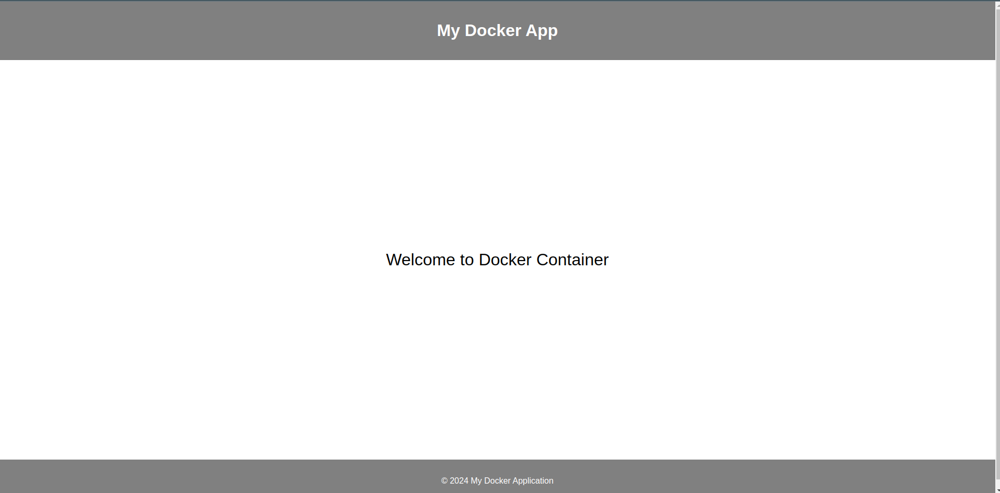

# Simple Docker File


## To run it:
1. clone this repo
2. run 
```bash
docker build -t nginx-docker-image .
```
3. you can change "nginx-docker-image" with any name you need
4. after it finish building the docker file run
```bash
docker run -d -p 1999:1999 nginx-docker-image
```
5. now you can access the webpage on the nginx server working on the docker container by opening http://localhost:1999 or http://0.0.0.0:1999/
6. this should be somthing like that




| **Command**                       | **Usage**                                                  |
|----------------------------------|-----------------------------------------------------------|
| <div align="center">**Docker Image Commands**</div> |||
| `docker pull [image]`           | Pull an image from a registry.                            |
| `docker build -t [name] [path]` | Build an image from a Dockerfile.                         |
| `docker images`                  | List all images.                                         |
| `docker rmi [image]`            | Remove an image.                                         |
| <div align="center">**Docker Container Commands**</div> |||
| `docker run [image]`            | Run a container from an image.                           |
| `docker run -d [image]`         | Run a container in detached mode (in the background).    |
| `docker ps`                      | List running containers.                                 |
| `docker ps -a`                   | List all containers (including stopped ones).            |
| `docker exec -it [container] [command]` | Execute a command inside a running container (e.g., bash). |
| `docker stop [container]`        | Stop a running container.                                 |
| `docker start [container]`       | Start a stopped container.                                |
| `docker rm [container]`          | Remove a container.                                      |
| `docker logs [container]`        | View the logs of a container.                            |
| `docker inspect [container]`     | Display detailed information about a container.          |
| <div align="center">**Docker Volume & Network Commands**</div> |||
| `docker volume ls`               | List all Docker volumes.                               |
| `docker volume rm [volume]`      | Remove a volume.                                      |
| `docker network ls`              | List all Docker networks.                              |
| `docker network rm [network]`    | Remove a network.                                     |
| <div align="center">**Docker Compose Commands**</div> |||
| `docker-compose up`              | Start services defined in a `docker-compose.yml` file. |
| `docker-compose down`            | Stop and remove services and networks defined in the Compose file. |
| `docker-compose ps`              | List containers managed by Compose.                    |
